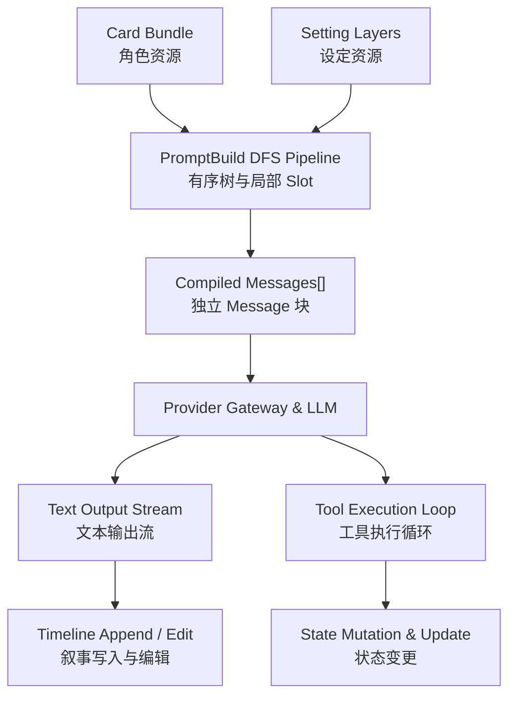

<div align="center">


# Loom Studio

**Weave worlds, interweave stories.**  
*编织世界，交织故事*

[](https://opensource.org/licenses/MIT)
[](package.json)
[](tsconfig.packages.json)
[](docs/architecture/)
[](docs/guide/beta-release.md)
[](https://github.com/The-LoomStudio/LoomStudio/actions/workflows/ci.yml)
[](https://github.com/The-LoomStudio/LoomStudio/releases)
[](docs/guide/)

<p align="center">
  <a href="#核心特性">核心特性</a> •
  <a href="#快速上手">快速上手</a> •
  <a href="#编译与执行数据流">编译管线</a> •
  <a href="#项目结构">项目结构</a> •
  <a href="#文档导航">文档体系</a>
</p>

[下载 Beta](https://github.com/The-LoomStudio/LoomStudio/releases) ·
[安装指南](docs/guide/beta-release.md) ·
[反馈问题](https://github.com/The-LoomStudio/LoomStudio/issues)

</div>

---

## 项目简介

**Loom Studio** 是专为 AI Native 时代设计的现代交互叙事与智能体编排工作台。

Loom Studio 集成 **Loom Core** 编译核心，将提示词编排（PromptBuild）、非线性时间线分支（Narrative Timeline）、设定资源与 Agent 工具链放在同一个工作台中，为创作者与玩家提供可组织、可追溯的叙事上下文。

> 当前为 Beta，不是稳定版。不承诺自动更新、数据恢复或降级兼容；升级前请自行备份。

---

## 核心特性

<table>
  <tr>
    <td width="50%" valign="top">
      <h3>预设即有序树 & 笼中深度</h3>
      <p>彻底告别传统的矩阵投影与深度争夺军备竞赛。预设是一棵干净的有序树，单次线性 DFS 遍历编译；外部世界书与卡片注入目标 Anchor 自动聚合为 Slot，局部深度（<code>1~9999</code>）严格封闭隔离，绝不打乱主干排版。</p>
    </td>
    <td width="50%" valign="top">
      <h3>时间线非线性叙事分支</h3>
      <p>像 Git 分支一样自由探索故事流向。支持随时建立多分支支线、节点级时光回溯与段落重演，结合底层细粒度事务保障，让每一段对话与世界发展都拥有可靠的持久化记忆。</p>
    </td>
  </tr>
  <tr>
    <td width="50%" valign="top">
      <h3>Message 一等公民容器</h3>
      <p>所见即所得的消息边界。彻底剔除老旧工具中对相邻同角色消息的黑盒暴力合并；预设树上定义了几个 Message 块，大模型即精准接收几条物理消息，角色继承与作用域极其纯粹。</p>
    </td>
    <td width="50%" valign="top">
      <h3>Agent Tools & 动态上下文闭环</h3>
      <p>深度打通双向智能体能力。内置状态读写（<code>read_state</code> / <code>update_state</code>）、叙事交互工具（<code>append_narrative</code> / <code>edit_narrative</code>）与 Fresh Context 动态挂载，赋予模型修改世界并实时反馈的真正自主能力。</p>
    </td>
  </tr>
</table>

---

## 编译与执行数据流



---

## 快速上手

### 下载与游玩

先安装 **Node.js 22.18.0 或更新版本**，确保当前账户可以使用 `node` 和 `npm`。
程序不携带 Node.js 或依赖，首次启动需要联网。

从 [Releases](https://github.com/The-LoomStudio/LoomStudio/releases) 下载已发布的 Beta 成品包并解压。
若尚无发行包，可使用下方源码路径；GitHub 自动生成的 Source code 压缩包属于源码，不是预构建成品。

| 系统 | 启动入口 |
| --- | --- |
| Windows | `start.bat` |
| macOS | `start.command` |
| Linux | `./start.sh` |
| 通用命令 | 在程序目录运行 `npm start` |

首次启动会安装依赖，之后直接启动。macOS 执行权限或安全提示需按本机设置处理；
Linux 双击行为取决于文件管理器，目前未进行 Linux 实机人工验收。

打开服务窗口显示的地址，默认是 **http://127.0.0.1:4173**，运行期间保持服务窗口开启。
端口占用时停止其他实例，或通过 `PORT` 环境变量指定端口。
前端已由 Node.js 服务托管，玩家无需分别启动前后端。

### 从源码游玩

```sh
git clone https://github.com/The-LoomStudio/LoomStudio.git
cd LoomStudio
npm start
```

也可以使用相同的启动脚本。首次启动会通过 npm 调用固定版本 pnpm 安装依赖，
在缺少构建产物时构建应用。更新源码后需主动运行 `pnpm build:app`；
启动脚本不会检测源码是否变化。

开始对话前，还需要在应用中配置账户、API 凭据、模型并绑定预设；
基础内容不提供 API Key 或模型绑定。服务仅供本机使用，不承诺局域网、公网或移动端访问。
用户数据与程序文件分开保存，路径和系统凭据限制见 [Beta 安装与发布指南](docs/guide/beta-release.md)。

### 官方扩展

官方扩展也是独立、可选的扩展，不随主程序自动安装或授权。
ST 格式导入由兼容扩展提供，是过渡能力，不是原生能力；
The World 同样独立发行，不是主程序启动前提。

远程链接安装仍未实现，当前保留的本地导入入口不代表远程安装流程已完成。
可执行 Server 扩展是可信同进程代码，**不是安全沙箱**；安装前确认来源和权限。

## 开发环境

### 环境准备

- **Node.js**: 开发工具链固定 `22.18.0`（`.node-version` / `.nvmrc`）
- **pnpm**: 开发工具链固定 `9.15.0`（`package.json` 的 `packageManager`）

根 `package.json` 的最低运行要求为 Node `>=22.18.0`、pnpm `>=9.0.0`；开发环境按上述固定版本对齐。

### 1. 安装依赖

```bash
pnpm install --frozen-lockfile
```

### 2. 启动开发环境

在两个独立终端分别启动服务端与客户端；两个命令均会先构建并监听内部 Packages：

```bash
# 启动后端核心服务 (端口 4173)
pnpm dev:server

# 在另一个终端中启动前端客户端工作台 (端口 5173)
pnpm dev:client
```

启动完成后，在浏览器中访问 [http://127.0.0.1:5173](http://127.0.0.1:5173) 即可进入 Loom Studio 创作工作台。

### 3. 运行自动化检查与测试

```bash
# 运行默认测试集（unit、contract、integration、regression；不含 probes / stress）
pnpm test

# 运行集成测试套件
pnpm exec vitest run tests/integration

# 编译检查所有 packages
pnpm build:packages

# 构建完整主应用（Packages、Server 与 Client）
pnpm build:app
```

---

## 项目结构

项目采用严格的四层分层架构，单向依赖，高内聚低耦合：

```text
LoomStudio/
├── public/                 # 公共展示静态资源 (Logo、Banner、视频等)
│   ├── images/
│   └── videos/
├── apps/                   # 独立应用层
│   ├── studio-server/      # 服务端核心网关与 RPC 服务 (Node.js/node:http)
│   ├── studio-client/      # 前端交互工作台 (React 19 / Vite / SCSS)
│   └── playground/         # 本地命令行验证沙箱 (Kernel / CodeAct)
├── packages/               # 核心领域包与基础设施层 (19 个独立 Package)
│   ├── core/               # @loom/core 同步编译内核管道
│   ├── application-runtime/# AIRP 领域编排、Agent Loop 与 PromptBuild 管线
│   ├── application-data/   # Agent、Narrative、State、Prompt Resource 统一领域存储
│   ├── data-engine/        # 统一 SQLite 事务、命名空间迁移与提交事实通道
│   ├── ai-gateway/         # 多模型厂商调度网关、流式执行与能力画像映射
│   ├── blob-store/ & asset-store/ # 内容寻址不可变字节与多媒体资产存储
│   ├── kernel/ & transport/       # 平台服务组装、RPC 路由与通信信封契约
│   ├── extension-sdk/      # 平台扩展 SDK 与独立 Extension Host
│   ├── secret-store/       # 敏感凭据安全隔离与操作系统 Keyring 托管
│   ├── diagnostics/ & logging/    # 有界运行时诊断注册表与跨端结构化日志
│   └── loom-ui/ & shared/  # 共享设计系统组件、图标原语与跨端同构基础

├── official/               # 官方基础内容与正式扩展源码
├── examples/               # 可通过正式导入路径运行的教程样本
└── docs/                   # 完整架构设计与演进规范文档
```

---

## 文档导航

开始修改代码或了解深层设计之前，请查阅完整文档体系 [`docs/README.md`](docs/README.md)：

- **[`docs/guide/workspace-development.md`](docs/guide/workspace-development.md)** — 全仓开发规范、共同契约与任务路线
- **[`docs/guide/beta-release.md`](docs/guide/beta-release.md)** — 玩家安装、数据目录、发行命令与 Beta 限制
- **[`docs/architecture/`](docs/architecture/)** — 核心领域稳定架构合同（PromptBuild、Timeline、Agent、State）
- **[`docs/workbench/`](docs/workbench/)** — 演进中的设计提案与讨论
- **[`docs/archive/`](docs/archive/)** — 已落地完成的历史实施计划与归档总结

---

## 参与贡献

问题反馈请附上系统、Node.js 版本、启动方式和相关日志，不要上传 API Key 或其他私密数据。

欢迎提交 Issue 和 Pull Request。在开始贡献前，请确保：
1. 恪守 KISS 原则与极简主义，杜绝过度工程；
2. 保持测试覆盖，提交前执行 `pnpm build:packages` 与相关定向测试；
3. 遵循现有的代码风格与命名契约。

<div align="center">

### 项目活动


[](https://github.com/The-LoomStudio/LoomStudio/graphs/contributors)

### 一起编织下一段故事

[](https://www.star-history.com/#The-LoomStudio/LoomStudio&Date)


感谢每一位参与创作、测试和贡献的伙伴。

</div>

---

## 许可证

本项目采用 [MIT License](https://opensource.org/licenses/MIT) 开源协议。
