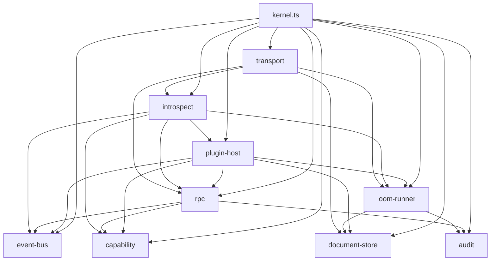
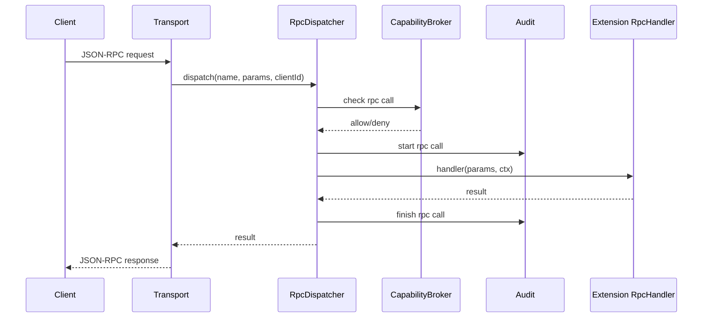
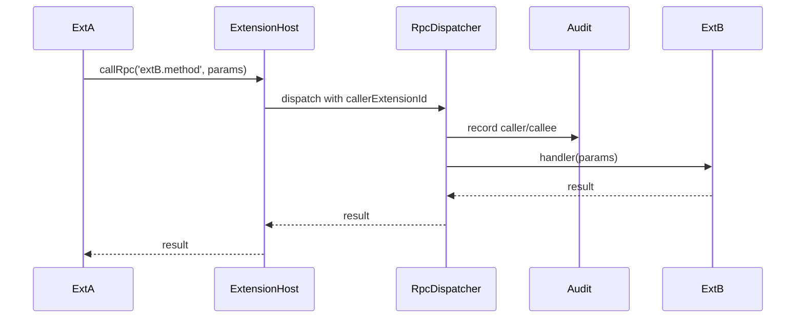
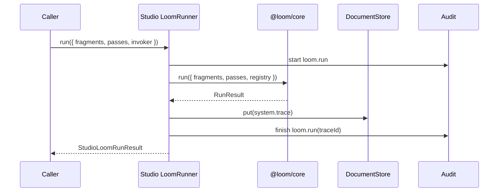

# Loom Studio MVP Engineering Blueprint

> **Status**: Archived / MVP Completed
> **Archived**: 2026-08-28；MVP Stage 5 已通过，当前工程与架构入口见 [`docs/guide/`](../../guide/) 和 [`docs/architecture/`](../../architecture/)。
> **Purpose**: 将 `loom-studio-architecture.md` v0.4 的边界决策翻译成 Loom Studio 独立仓库的最小工程实现路线。
> **Audience**: Studio Kernel 实现者、Extension 作者、独立客户端作者、DevTool 集成者。
> **Non-Replacement**: 本文不替代 Loom Studio Architecture、Core Engineering Blueprint 或 ADR；它只约束 Studio MVP 的工程实现。

---

## 0. 这份文档解决什么问题

Loom Studio 架构文档已经回答了：

- Studio 是什么，不是什么；
- Kernel 应该做什么、不做什么；
- Extension / Concept Stack / Runtime Extension 的边界；
- Studio 与 `@loom/core` 的接合面；
- Runtime / Provider / Tool / MCP 都是 Extension Pattern，而不是 Kernel Service；
- Studio 借用 OS 的边界纪律，但不是操作系统。

但正式开发 Loom Studio 前，还需要一份更低层的工程蓝图，回答：

1. 独立 `LoomStudio` 仓库的初始目录应该长什么样；
2. Kernel MVP 的最小服务切片是什么；
3. 每个模块负责什么、不负责什么；
4. 一次 Extension RPC / `loom.run` / trace 写入的数据流怎么走；
5. Studio MVP 明确不做哪些事情；
6. 测试矩阵和实现顺序是什么。

本文目标不是扩张设计面，而是**收窄第一版实现面**。

> **2026-05-15 收口说明**：本文保留 MVP 分阶段思路和 guardrails；仓库结构、package 命名、Manifest contract、Document model、RPC method 细节已由以下 v0 文档覆盖：
> - [`studio-repository-engineering-v0.md`](studio-repository-engineering-v0.md)
> - [`studio-initial-package-api-v0.md`](studio-initial-package-api-v0.md)
> - [`../05-extensions/studio-extension-manifest-architecture.md`](extensions/studio-extension-manifest-architecture.md)
> - [`../03-kernel/studio-rpc-methods-v0.md`](kernel/studio-rpc-methods-v0.md)
> - [`../04-data/studio-document-store-engineering-v0.md`](../../workbench/discussion/data/studio-document-store-engineering-v0.md)
>
> 本文中出现的 `plugin-sdk`、`packages/protocol`、`apps/studio-kernel`、`server.contributes`、`client.bundle`、`Document.data`、`pluginId` 等早期命名均视为历史草案，不作为施工依据。正式命名统一采用 `extension-sdk`、`transport`、`apps/studio-server` / `apps/studio-client`、顶层 `contributes`、`client.entry`、`DocumentRecord.content`、`ownerExtensionId`。

---

## 0.1 当前仓库状态（2026-05-02）

当前 `LoomStudio` 是空白独立目录，尚未初始化工程。

目标第一阶段落地范围：

```text
LoomStudio/
  apps/studio-server/          Studio Kernel MVP（Node.js + Transport）
  packages/extension-sdk/      Extension 作者辅助类型与 host helpers
  packages/transport/          Transport / manifest / introspection 的稳定类型
  packages/devtool-adapter/    可选：把 @loom/devtool 接入 Studio trace document
  examples/extensions/         最小 bundled examples
  examples/clients/            headless client / rogue composer 示例
```

第一阶段不做正式 Web UI。可以保留一个极简 headless client / CLI 验证 Transport。

---

## 1. MVP 工程原则

### 1.1 Studio Kernel 是能力底座，不是运行时

Kernel MVP 只提供：

```text
Document Store
Plugin Host
RPC Registry
Event Bus
Capability Broker（MVP 先 declare + audit，可不强 enforcement）
Loom Runner
Transport
Introspection
Trace / Audit 写入
```

Kernel 不提供：

- Chat Runtime；
- Agent Runtime；
- Provider Gateway；
- Tool Loop；
- MCP Bridge；
- `messages[]` schema；
- provider-neutral invocation schema；
- official chat / character / worldbook schema。

这些都是 Extension Pattern。

### 1.2 Studio 借用 OS 边界纪律，不继承 OS 功能清单

Studio 不是操作系统。OS 隐喻只用于工程边界：

- Kernel 保持小；
- Extension 构成用户态；
- Transport / RPC 是稳定接口；
- Document Store 是持久化底座；
- Capability Broker 提供权限边界；
- Trace / Audit 提供系统级可观测性；
- 官方 Web UI 是 shell，不是平台本身。

> Studio 是工作台，不是操作系统；但它用 OS 的边界纪律来组织 Extension 生态。

### 1.3 Transport API 是真实契约

官方 Web UI、CLI、第三方客户端、Extension Client Part 都不能走后门。MVP 里所有可见能力都应通过 Transport 或 Plugin Host 注入的 Extension Host API 暴露。

### 1.4 Kernel 跑 pipeline，不跑 session

每次 `kernel.loom.run` 都是独立 invocation：

```text
fragments + passConfigs + registry + invoker + options -> RunResult + system.trace
```

Kernel 不维护：

- currentSession；
- activeStack；
- currentCharacter；
- currentProvider；
- runningAgent；
- global runtime loop。

### 1.5 一切注册物必须可发现

MVP 的 `system.introspect` 至少枚举：

- extensions；
- documentTypes；
- passes；
- rpc；
- events；
- commands（可为空）；
- capability declarations；
- kernel / loom version。

---

## 2. Public Surface 草案

### 2.1 Manifest

MVP manifest 只实现必要字段：

```ts
interface ExtensionManifest {
  id: string
  version: string
  engines: {
    studio: string
    loom: string
  }
  server?: {
    entry: string
    isolation?: 'inproc' | 'worker'
    capabilities?: {
      requires?: string[]
      optional?: string[]
    }
    contributes?: {
      documentTypes?: DocumentTypeContribution[]
      passes?: PassContribution[]
      rpc?: RpcContribution[]
      events?: EventContribution[]
      commands?: CommandContribution[]
    }
  }
  client?: {
    bundle: string
  }
  activation?: {
    events?: string[]
  }
}
```

MVP 约束：

- 只支持 local filesystem plugin path；
- `isolation: 'worker'` 字段可解析，但先返回 not supported；
- manifest 未实现字段必须 reserved-but-rejected 或 reserved-but-ignored 明确区分；
- extension id 必须全局唯一；
- RPC 名建议使用 `extensionId.method` 命名空间，MVP 应校验冲突。

### 2.2 Extension Host API

Server Part 激活时获得 `host`：

```ts
interface ExtensionHost {
  readonly extensionId: string

  documents: DocumentApi
  events: EventApi
  loom: LoomApi

  registerDocumentType(contribution: DocumentTypeContribution): void
  registerPass(factory: PassFactory): void
  registerRpc(contribution: RpcContribution, handler: RpcHandler): void
  registerEvent(contribution: EventContribution): void

  callRpc(name: string, params: unknown): Promise<unknown>
  audit(event: AuditInput): void
}
```

约束：

- 不暴露整张 RPC map；
- Extension 间调用只能走 `host.callRpc(name, params)`；
- `host.callRpc` 必须进入 audit；
- host 不提供 Kernel 私有对象引用；
- Pass 代码不应调用 host。需要 IO / RPC 的逻辑写在 Server Part 非 Pass 部分，结果通过 params / fragments 注入 Pass。

### 2.3 Document API

```ts
interface Document<T = unknown> {
  id: string
  type: string
  version: number
  content: T
  meta: {
    createdAt: string
    updatedAt: string
    ownerExtensionId?: string
    tags?: string[]
  }
}
```

MVP API：

```ts
interface DocumentApi {
  get(id: string): Promise<Document | null>
  put(doc: Document): Promise<Document>
  patch(id: string, patch: unknown, expectedVersion: number): Promise<Document>
  list(type: string, query?: unknown): Promise<Document[]>
}
```

MVP 可以先不实现 subscribe，由 Event Bus 承担变更通知；但接口设计要预留 watch / subscribe。

### 2.4 RPC API

```ts
interface RpcContribution {
  name: string
  description?: string
  paramsSchema?: unknown
  returnsSchema?: unknown
  stream?: boolean
  capabilities?: string[]
}

type RpcHandler = (params: unknown, ctx: RpcContext) => Promise<unknown> | unknown
```

MVP 约束：

- RPC 名全局唯一；
- Extension RPC 必须命名空间化；
- handler 可以 sync 或 async；
- streaming RPC 可先只设计 framing，不要求第一阶段实现 provider streaming；
- RPC 调用进入 audit；
- RPC params / result 不由 Kernel 做业务校验，schema 主要用于 introspection。

### 2.5 Loom Runner API

Kernel 对 `@loom/core` 的包装：

```ts
interface StudioLoomRunRequest {
  fragments: Fragment[]
  passes: PassConfig[]
  invoker: {
    stackId?: string
    clientId: string
    callerRef?: string
  }
  trace?: TraceOptions
}
```

返回：

```ts
interface StudioLoomRunResult {
  status: 'ok' | 'error'
  fragments: Fragment[]
  diagnostics: Diagnostic[]
  traceId?: string
  error?: SerializedError
}
```

约束：

- 使用全局 PassRegistry，但 Kernel 不重排 Pass；
- `stackId` / `callerRef` 是 audit string，不做权限判断；
- `clientId` 由 Transport 注入；
- Core trace 写入 `system.trace` Document；
- trace 写入可 fire-and-forget，但 MVP 测试可以用同步 flush 模式保证可断言。

---

## 3. Ideal Repository Layout

```text
LoomStudio/
├── package.json
├── pnpm-workspace.yaml
├── tsconfig.base.json
├── docs/
│   └── loom-studio-mvp-engineering.md
│
├── apps/
│   └── studio-kernel/
│       ├── package.json
│       ├── src/
│       │   ├── index.ts
│       │   ├── cli/
│       │   │   ├── start.ts
│       │   │   └── dev.ts
│       │   ├── kernel/
│       │   │   ├── kernel.ts
│       │   │   ├── document-store/
│       │   │   │   ├── types.ts
│       │   │   │   ├── sqlite-store.ts
│       │   │   │   └── memory-store.ts
│       │   │   ├── plugin-host/
│       │   │   │   ├── loader.ts
│       │   │   │   ├── manifest.ts
│       │   │   │   ├── extension-host.ts
│       │   │   │   └── registry.ts
│       │   │   ├── rpc/
│       │   │   │   ├── registry.ts
│       │   │   │   ├── dispatcher.ts
│       │   │   │   └── types.ts
│       │   │   ├── events/
│       │   │   │   ├── bus.ts
│       │   │   │   └── types.ts
│       │   │   ├── capability/
│       │   │   │   ├── broker.ts
│       │   │   │   └── types.ts
│       │   │   ├── loom-runner/
│       │   │   │   ├── runner.ts
│       │   │   │   └── trace-document.ts
│       │   │   ├── introspect/
│       │   │   │   └── introspect.ts
│       │   │   ├── audit/
│       │   │   │   ├── audit.ts
│       │   │   │   └── types.ts
│       │   │   └── transport/
│       │   │       ├── json-rpc.ts
│       │   │       ├── websocket.ts
│       │   │       └── stream.ts
│       │   └── test-support/
│       └── test/
│           ├── document-store.test.ts
│           ├── plugin-host.test.ts
│           ├── rpc.test.ts
│           ├── loom-runner.test.ts
│           ├── introspect.test.ts
│           └── e2e-kernel.test.ts
│
├── packages/
│   ├── protocol/
│   │   └── src/
│   │       ├── manifest.ts
│   │       ├── transport.ts
│   │       ├── introspect.ts
│   │       ├── document.ts
│   │       └── index.ts
│   └── extension-sdk/
│       └── src/
│           ├── define-extension.ts
│           ├── define-rpc.ts
│           ├── define-event.ts
│           ├── define-document.ts
│           ├── define-pass.ts
│           └── index.ts
│
└── examples/
    ├── extensions/
    │   ├── passext-upper/
    │   └── stack-mini/
    └── clients/
        ├── headless-invoke.ts
        └── rogue-compose.ts
```

MVP 可以先只实现 `apps/studio-server` + `packages/transport` + 最小 examples。`extension-sdk` 可以非常薄，避免过早抽象。

---

## 4. Module Responsibility Map

### 4.1 `document-store/`

负责：

- Document CRUD；
- optimistic version；
- `system.*` Document 写入；
- SQLite / memory backend；
- 基础 list query。

不负责：

- chat / character / worldbook 语义；
- schema 校验；
- projection；
- full-text search；
- vector search。

### 4.2 `plugin-host/`

负责：

- 读取 local extension；
- 解析 manifest；
- 校验 engines / id / contributes；
- 激活 server entry；
- 创建 ExtensionHost；
- 收集 extension contributions。

不负责：

- npm / git 安装；
- SAT resolver；
- worker isolation；
- marketplace；
- auto update。

### 4.3 `rpc/`

负责：

- RPC 注册；
- name conflict 检测；
- dispatcher；
- `host.callRpc`；
- Transport RPC 请求转发；
- audit hook。

不负责：

- provider 语义；
- messages schema；
- tool loop；
- business payload validation。

### 4.4 `events/`

负责：

- in-process pub/sub；
- event contribution registry；
- client subscription bridge（MVP 可简化）；
- event payload 透传。

不负责：

- 业务事件命名；
- delivery guarantee；
- persistent event log。

### 4.5 `capability/`

MVP 负责：

- manifest capability declaration 收集；
- grant model 类型；
- audit allow / deny 决策点；
- 第一阶段可默认 allow local trusted extension，但必须记录。

不负责：

- 强沙箱；
- worker permission proxy；
- network syscall interception；
- secret manager。

### 4.6 `loom-runner/`

负责：

- 持有 Studio 全局 PassRegistry；
- 将 extension pass factory 注册进 registry；
- 调用 `@loom/core run({ fragments, passes, registry })`；
- 生成 `system.trace` Document；
- 写入 invocation metadata。

不负责：

- 自动 compose；
- session；
- provider call；
- messages emit；
- capability lint。

### 4.7 `introspect/`

负责聚合：

- kernel version；
- loom version；
- loaded extensions；
- documentTypes；
- passes；
- rpc；
- events；
- commands；
- capabilities。

不负责：

- 业务分组；
- UI 展示；
- permission-filtering（MVP 可先全量，后续再裁决）。

### 4.8 `audit/`

负责记录：

- RPC call；
- `host.callRpc`；
- loom.run；
- capability decision；
- extension activation；
- errors。

MVP 建议字段：

```ts
interface AuditRecord {
  id: string
  type: string
  callerExtensionId?: string
  clientId?: string
  rpcName?: string
  traceId?: string
  parentCallId?: string
  correlationId?: string
  startedAt: string
  endedAt?: string
  status: 'ok' | 'error' | 'denied'
  error?: SerializedError
  meta?: Record<string, unknown>
}
```

`parentCallId` / `correlationId` 是为了后续 Runtime Extension 的调用链 DevTool 预留，不携带业务语义。

### 4.9 `transport/`

负责：

- WebSocket server；
- JSON-RPC 2.0 framing；
- client id 注入；
- request / response correlation；
- stream framing 预留。

不负责：

- auth token（MVP 可 postponed）；
- Web UI；
- provider streaming payload 语义。

---

## 5. Kernel Dependency Diagram



约束：

- `document-store` 不依赖其他业务模块；
- `rpc` 不依赖 provider / runtime 语义；
- `loom-runner` 只依赖 `@loom/core` 和 document / audit；
- `plugin-host` 是 Extension 接入唯一入口；
- `transport` 不直接访问 Extension 实例，只走 registry / dispatcher。

---

## 6. Runtime Data Flows

### 6.1 Extension RPC 调用



### 6.2 Extension 间 RPC 调用



关键：Extension 不拿 RPC map，只通过 `host.callRpc`。

### 6.3 Loom Run



MVP 可以同步写 trace 方便测试；正式语义可改为 fire-and-forget。

### 6.4 Runtime Extension Loop（非 Kernel 内置）

```text
Runtime Extension RPC
  → 读 Document / 自身 state
  → 构造 Fragment[]
  → 调 kernel.loom.run
  → 调 Provider Extension RPC
  → 如有 tool call，调 Tool / MCP Extension RPC
  → 写回 Document / Event
  → 需要时再次构造 Fragment[] 并 loom.run
```

Kernel 只看到独立 RPC / Document / Event / Loom Run / Audit，不理解这个循环的业务含义。

---

## 7. MVP Extension Examples

### 7.1 `passext-upper`

目标：证明 Pass-only Extension。

贡献：

- `passext-upper.uppercase` pass factory；
- 无 Document type；
- 无 Client Part。

验收：

- manifest 加载成功；
- pass 出现在 `system.introspect`；
- 可被 `kernel.loom.run` 的 PassConfig 引用；
- trace 中可见 mutation。

### 7.2 `stack-mini`

目标：证明 Concept Stack Extension form，但不定义平台 Runtime。

贡献：

- `stack-mini.character` Document type；
- `stack-mini.session` Document type；
- `stack-mini.compose` RPC；
- `stack-mini.invoke` RPC；
- 若干 pass factories。

约束：

- `invoke` 只是 Extension RPC 示例，不是 Kernel Chat Runtime；
- 输出 payload 是 stack-mini 私有格式，不是平台 `messages[]` contract；
- 不调用真实 provider。

### 7.3 `provider-dummy`（可选，不进第一阶段）

目标：未来验证 Provider Extension Pattern。

贡献：

- `provider-dummy.invoke` RPC；
- 返回 echo response；
- 不进入 Kernel service。

该 example 只有在 RPC / audit / stream framing 需要验证时再加入，不阻塞 Kernel MVP。

---

## 8. Testing Matrix

### 8.1 Document Store

- put / get roundtrip；
- version 单调递增；
- expectedVersion mismatch 失败；
- list by type；
- system.trace 可写；
- orphan type 不阻塞读取。

### 8.2 Manifest / Plugin Host

- 加载 local extension；
- extension id 重复报错；
- RPC name 冲突报错；
- pass name 冲突报错；
- unsupported worker isolation 返回明确错误；
- manifest unknown field 行为明确；
- server entry 缺失报错。

### 8.3 RPC

- client 调 extension RPC 成功；
- extension A 通过 `host.callRpc` 调 extension B 成功；
- 找不到 RPC 返回结构化错误；
- RPC throw 返回结构化错误；
- RPC 调用进入 audit；
- paramsSchema 进入 introspection。

### 8.4 Event Bus

- 注册 event contribution；
- emit / subscribe；
- event schema 进入 introspection；
- 慢 subscriber 不阻塞 emitter（MVP 可用 async queue 简化）。

### 8.5 Loom Runner

- 注册 extension pass factory；
- `loom.run` 能按 PassConfig 调用 pass；
- invoker 写入 system.trace；
- traceId 返回给 caller；
- pass error 返回结构化错误；
- concurrent loom.run 不共享状态。

### 8.6 Introspection

- 返回 kernel / loom version；
- 返回 extensions；
- 返回 documentTypes；
- 返回 passes；
- 返回 RPC；
- 返回 events；
- 返回 capabilities；
- 两个 extension 时输出仍可读。

### 8.7 Capability / Audit

- capability declaration 被记录；
- RPC call 产生 audit record；
- host.callRpc 产生 callerExtensionId；
- loom.run 产生 traceId 关联；
- parentCallId / correlationId 可透传。

### 8.8 Transport

- JSON-RPC request / response；
- JSON-RPC error；
- clientId 注入；
- headless client 不 import Studio package 也能调用；
- malformed request 不崩溃。

### 8.9 E2E

- 启动 Kernel；
- 加载 `passext-upper` + `stack-mini`；
- `system.introspect` 可见全部贡献；
- headless client 调 `stack-mini.invoke`；
- rogue client 调 `stack-mini.compose`，插入 `passext-upper.uppercase`，再直接调 `loom.run`；
- 两个 client concurrent invoke 互不干扰；
- 卸载 example extension 后，旧 `system.trace` 仍可只读查看。

---

## 9. Implementation Order

### 9.0 MVP Stages

实现顺序可以分成四个可验收阶段。每个阶段都应能独立跑测试，不依赖后续 UI / Provider / Runtime 工作。

#### Stage A — Empty Kernel Skeleton

目标：证明 Studio Kernel 可以作为一个 headless Node.js 进程启动，并提供最小 Document / RPC / Transport 能力。

包含：

- workspace / tsconfig / package scripts；
- `packages/transport` 初始类型；
- memory `DocumentStore`；
- `RpcRegistry` / `RpcDispatcher`；
- JSON-RPC over WebSocket；
- `system.introspect` 返回 kernel 基础信息。

验收：

- headless client 可以调用 `system.introspect`；
- malformed request 返回结构化 JSON-RPC error；
- Kernel 源码里没有 `currentSession` / `activeStack` / `currentProvider` / `runningAgent` 之类全局业务状态。

#### Stage B — Extension Host

目标：证明 Extension 可以作为普通 userland 能力接入 Kernel。

包含：

- local plugin loader；
- manifest parser；
- `ExtensionHost`；
- `registerRpc` / `registerEvent` / `registerDocumentType`；
- `host.callRpc`；
- audit MVP。

验收：

- 一个最小 Extension 注册 RPC 后可被 headless client 调用；
- Extension A 可以通过 `host.callRpc` 调 Extension B；
- Extension 永远拿不到整张 RPC map；
- 所有 RPC 调用产生 audit record。

#### Stage C — Loom Runner Integration

目标：证明 Studio Kernel 能作为 `@loom/core` 的受控入口，而不是让 Extension 绕过 Kernel 私自跑 pipeline。

包含：

- 全局 PassRegistry；
- Extension pass factory 注册；
- `kernel.loom.run` / Transport `loom.run`；
- `system.trace` Document；
- `passext-upper` example。

验收：

- `passext-upper.uppercase` 可通过 PassConfig 执行；
- trace 可写入 Document Store；
- 两个并发 `loom.run` 不互相污染；
- Extension pass 代码不 import Studio Kernel 模块。

#### Stage D — Concept Stack Shape

目标：证明 Concept Stack 是 Extension Pattern，而不是 Kernel 内置概念。

包含：

- `stack-mini` example；
- `stack-mini.compose`；
- `stack-mini.invoke` 私有 payload；
- rogue compose client。

验收：

- `stack-mini` 注册 documentTypes / passes / rpc；
- headless client 调 `stack-mini.invoke` 成功；
- rogue client 调 `stack-mini.compose`，插入 `passext-upper.uppercase` 后直接调 `loom.run` 成功；
- `stack-mini.invoke` 不被写成 Kernel runtime，不定义平台 `messages[]` contract。

### 9.1 线性实现顺序

```text
Step 1: 初始化 pnpm workspace / tsconfig / lint-free 基础结构
Step 2: packages/transport：Document / Manifest / RPC / Introspection 类型
Step 3: apps/studio-server：DocumentStore memory backend
Step 4: RpcRegistry + RpcDispatcher + JSON-RPC transport
Step 5: Audit 基础记录与 correlation 字段
Step 6: PluginHost local loader + manifest parser
Step 7: ExtensionHost + registerRpc / registerPass / callRpc
Step 8: LoomRunner 接入 @loom/core
Step 9: system.introspect
Step 10: EventBus MVP
Step 11: SQLite DocumentStore backend
Step 12: examples/extensions/passext-upper
Step 13: examples/extensions/stack-mini
Step 14: examples/clients/headless-invoke + rogue-compose
Step 15: E2E 测试矩阵
```

不要先做：

- official Web UI；
- Dock；
- Provider Gateway；
- real OpenAI / Anthropic API；
- Chat Runtime；
- Agent Runtime；
- Tool Loop；
- MCP Bridge；
- worker isolation；
- plugin resolver / installer；
- URL install；
- auth token；
- marketplace。

### 9.2 首批 PR 切分建议

为了避免一口气搭太大，建议首批 PR 按以下边界拆：

| PR | 内容 | 不允许夹带 |
|---|---|---|
| PR-1 | workspace / tsconfig / package scripts / 空测试跑通 | 任何 Kernel 业务逻辑 |
| PR-2 | `packages/transport` 的 Document / Manifest / RPC / Introspection 类型 | extension-sdk helper |
| PR-3 | memory DocumentStore + 单测 | SQLite、projection、schema validation |
| PR-4 | RpcRegistry / Dispatcher + 单测 | WebSocket、Extension loader |
| PR-5 | JSON-RPC Transport + headless client smoke test | auth、streaming payload 语义 |
| PR-6 | Manifest parser + local PluginHost | URL install、resolver、worker |
| PR-7 | ExtensionHost + registerRpc + host.callRpc + audit | PassRegistry、LoomRunner |
| PR-8 | LoomRunner + @loom/core 接入 + system.trace | Concept Stack、Provider |
| PR-9 | `passext-upper` example + E2E | `stack-mini` |
| PR-10 | `stack-mini` + rogue compose E2E | real provider、messages contract |

每个 PR 都应能独立解释“为什么这些代码属于当前阶段”。如果解释必须依赖未来 Runtime / Provider / UI，说明 PR 过大或边界错了。

---

## 10. Engineering Guardrails


这些检查用于防止 Studio MVP 在实现时滑向“内置应用框架”。

### 10.1 禁止 Kernel 业务概念

Kernel 源码中不应出现这些命名作为核心模块 / 全局状态：

```text
currentSession
activeStack
currentCharacter
currentProvider
chatRuntime
agentRuntime
toolLoop
providerGateway
messagesSchema
invocationDraft
```

出现这些词不一定绝对错误，但必须能解释为：

- 文档注释中的反例；或
- Extension example 的私有命名；或
- 测试里验证“Kernel 不含该概念”。

### 10.2 禁止 Pass 反向依赖 Studio

Example / Extension 中的 Pass 文件不应 import：

```text
apps/studio-server
@loom-studio/extension-sdk
ExtensionHost
DocumentStore
RpcDispatcher
```

Pass 只能依赖：

- `@loom/core`；
- 自己 package 内的纯函数 helper；
- params / fragments 中已经准备好的数据。

### 10.3 RPC 是唯一跨 Extension 调用面

Extension A 不应直接 import Extension B 的 server module。跨 Extension 能力调用只能走：

```ts
host.callRpc('other-extension.method', params)
```

这样 audit / capability / introspection 才能成立。

### 10.4 Schema 是 introspection 资产，不是 Kernel 业务校验

MVP 中 `paramsSchema` / `returnsSchema` / document type schema 主要用于：

- `system.introspect`；
- author docs；
- future UI form / DevTool；
- Extension 自己校验。

Kernel 不根据 schema 理解 chat、provider、tool、message 等业务语义。

### 10.5 Audit 记录事实，不解释业务

Audit 可以记录：

- caller；
- callee；
- rpcName；
- traceId；
- parentCallId；
- correlationId；
- status；
- duration；
- error。

Audit 不解释：

- 这是不是一次 chat turn；
- 这是不是一次 agent step；
- tool call 是否应该继续循环；
- provider response 是否应该保存成 assistant message。

这些解释属于 Runtime Extension / DevTool 上层视图。

---

## 11. Definition of Done

Studio Kernel MVP 完成判据：

1. 仓库 workspace 初始化完成；
2. Kernel 可启动；
3. local Extension 可加载；
4. Extension 可注册 Document type / Pass / RPC / Event；
5. `system.introspect` 可枚举所有贡献；
6. Transport JSON-RPC 可被 headless client 调用；
7. Extension 间 RPC 只能通过 `host.callRpc`；
8. `host.callRpc` 进入 audit；
9. `kernel.loom.run` 可调用 `@loom/core`；
10. PassRegistry 可消费 Extension pass factory；
11. `system.trace` Document 可写入；
12. concurrent loom.run 互不干扰；
13. `passext-upper` example 通过；
14. `stack-mini` example 通过；
15. rogue compose E2E 通过；
16. 卸载 Extension 后旧 trace 仍可只读查看；
17. 没有 Kernel 内置 Chat / Provider / Runtime / Tool / MCP 概念。

---

## 12. 后续文档衔接

MVP 蓝图之后，建议再补三份更窄的文档：

1. `studio-transport-v0.md`
   - JSON-RPC framing、stream framing、clientId、error shape。
2. `studio-extension-authoring-v0.md`
   - Extension anatomy、manifest、server entry、registerRpc / registerPass 示例。
3. `studio-audit-trace-correlation-v0.md`
   - audit record、traceId、parentCallId、correlationId、DevTool 调用链展示。

Provider / Runtime / Tool / MCP 的 spike 应等 Kernel MVP 跑通后单独立项，且只能作为 Extension spike，不应倒灌 Kernel service。
