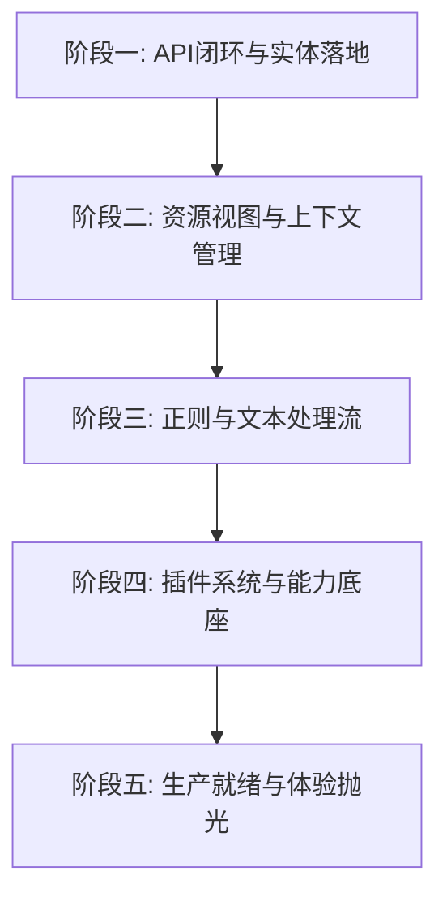

# Loom Studio 宏观开发路线图 (Macro Roadmap)

> **状态**：草案 v0.1 (2026-06-24)  
> **目的**：梳理 Loom Studio 从 MVP 基础底座走向生产力工具的宏观演进计划，告别“无头苍蝇”式的开发，让后续的迭代具有强烈的阶段感与方向感。

---

## 0. 当前开发状态盘点 (Where We Are)

通过回顾 Git 提交历史与代码，Loom Studio 已经完成了以下里程碑：
- **P0~P3 内核与底座**：已建立 `packages/kernel`, `loom-runner`, `extension-host` 的基本契约，支持简单的插件 RPC 注册与文档持久化。
- **前端基础组件 PoC**：`studio-client` 已搭建起 Timeline（叙事画布）、Inspector（属性与步骤检查）、Resource（卡片/配置）、API Panel（接口供应商）等基础 UI 骨架。
- **PromptBuild 与 API 闭锁**：初步打通了 Prompt 拼装、事实/条件激活规则（Activation Facts & Conditions），并能真正调用模型 API 产生对话交互。

**主要痛点**：目前我们依然处于“验证可行性”的阶段，部分界面存在 Mock 数据，资源管理（Context Assets）尚未与实际的 Prompt 构建完全联动，导致开发没有阶段性的终点。

---

## 1. 宏观五阶段演进计划

为了让开发过程具有清晰的目标感，我们将后续的开发拆分为五个高度聚合的物理阶段。每一个阶段都有一个明确的**核心交付物**与**准退标准**。

---

### 阶段一：API 闭环与核心实体落地 (当前收尾)
* **核心目标**：彻底告别 Mock 数据，让角色卡、会话、API 配置能够从前端写入 SQLite 数据库，并驱动真实的 AI 对话与 Trace 链路。
* **主要任务**：
  1. **实体持久化闭环**：
     - 完成 `Card`（角色卡）和 `Session`（对话分支）的 CRUD 接口联调，确保数据保存在 `document-store`（SQLite）中。
     - 整合 `provider-settings` 里的 Gateway 配置，允许在 UI 中编辑并持久化模型 Profile。
  2. **Prompt 预览与调试控制**：
     - 完善 `features/prompt-build` UI，用户在输入框打字或调整激活条件（Facts）时，实时展示拼装后的 Messages。
     - 跑通 `loom.run` 时的完整 Trace 和 Diagnostics，确保在 Inspector 视图中能查看到本次调用的步骤、耗时和详细 Token。
* **完成标志 (Definition of Done)**：
  - 能够创建一个全新的角色卡，启动新会话，配置自己的 API Key，并进行正常的单轮/多轮对话，且整个过程无需任何 Mock 数据库支持，测试用例 100% 通过。

---

### 阶段二：资源视图与上下文管理 (Resource & Context Asset System)
* **核心目标**：实现复杂、分层的提示词上下文资源库。让用户能够像管理项目文件一样管理 AI 的背景信息。
* **主要任务**：
  1. **资源视图编辑器 (`widgets/context-workbench`)**：
     - 允许用户在左侧创建文件夹、文本文件、JSON 配置文件或 Preset 节点（例如世界设定、记忆回音、长期记忆片段）。
     - 支持节点的多选、拖拽、复制、删除 and 移动，统一采用 `features/context-assets/model/tree-ops.ts`。
  2. **上下文投影与组装逻辑 (Projection & Sorting)**：
     - 实现 `ProjectionOrder` 机制：根据设定的 order（如 `fixed: 100` 或 `last`）和 zone，将上下文节点排序并投影成 Prompt 里的片段。
     - 实现 **Lifecycle 控制**：不同的上下文资源有不同的生命周期（如 `always` 总是注入、`current-turn` 仅当前轮、`tag-activated` 关联特定标签激活）。
  3. **实时预览与占位符高亮**：
     - 在 Prompt 预览区，能够看到哪些文字片段是由哪个资源视图中的文件投影而来的，双击可直接定位并编辑该文件。
* **完成标志 (Definition of Done)**：
  - 用户可在资源视图中创建一个“世界观-魔法体系.txt”，设定其生命周期为“在包含`魔法`标签时激活”。当在对话框输入“我释放了一个魔法”时，右侧 Prompt 预览自动高亮并插塞该文件内容。

---

### 阶段三：正则处理与文本流水线 (Regex & Prompt Transformations)
* **核心目标**：引入高阶开发者的必杀器——利用正则表达式和文本转换器，对 AI 输入前的 Prompt、以及 AI 输出后的 Payload 进行清洗、过滤和二次加工。
* **主要任务**：
  1. **正则表达式预处理 (Pre-Processors)**：
     - 支持在 Pipeline 中配置正则匹配规则。例如：自动将输入中的 `[角色名]` 替换为当前选中的 Card Name。
     - 敏感词屏蔽或自定义语法转义。
  2. **输出流的结构化解析 (Post-Processors & RegEx Extraction)**：
     - 针对 AI 吐出的非结构化文本，利用正则提取出特定的“行动”、“独白”或“状态变化”（例如：用 `([\s\S]*)` 提取出动作括号内的内容）。
     - 允许将提取出的数据自动写入 `document-store` 或驱动 UI 状态变化（如角色好感度 `+1`）。
  3. **文本重写机制 (Text Transform Rules)**：
     - 结合 `Loom Core` 的 Pass 机制，在 `packages/loom-runner` 中接入特定的正则 Pass，将其配置化展示在 Client UI 中。
* **完成标志 (Definition of Done)**：
  - 配置一条正则规则：当 AI 吐出 `[心情: 悲伤] 广播只负责确认还有谁会回应。` 时，正则后处理器将 `[心情: 悲伤]` 过滤掉，并将“心情值=悲伤”作为结构化状态同步更新到 UI 侧。

---

### 阶段四：高级能力插件 (Advanced Extensions Host & SDK)
* **核心目标**：将 Studio 的能力边界彻底推向“生态级”，让第三方插件能够无缝注入全新的功能与视图。
* **主要任务**：
  1. **前端插件挂载点 (Client extension entry)**：
     - 允许插件在 UI 中注册自定义面板（如增加一个渲染特效的 Tab，或一个专门用来测试正则的 Sandbox）。
     - 使用 Iframe / Web Components 或安全的 JS 动态载入，与核心 UI 隔离。
  2. **更完善的 Extension SDK**：
     - 暴露 `ctx.workspace` API，让插件能读取当前项目结构。
     - 实现 `ctx.rpc` 的双向通信：核心向插件发通知，插件调核心 RPC。
  3. **自省机制 (Introspection Dashboard)**：
     - 在 Client 中提供一个“自省工作台”（`preset-workbench`），可视化当前所有已激活插件、他们声明的 Capabilities 以及注册的 API 拓扑图。
* **完成标志 (Definition of Done)**：
  - 编写一个包含前端 UI 的插件，安装后能在 Client 的侧边栏新增一个自定义 Tab，在这个 Tab 里点击按钮能通过 RPC 触发核心的 Prompt 构建，并成功在 Narrative Canvas 中显示。

---

### 阶段五：生产就绪与体验抛光 (Production Readiness & DX)
* **核心目标**：打磨性能与使用体验，提升开发者开发 Extension 的效率，使 Loom Studio 成为能稳定使用的开发平台。
* **主要任务**：
  1. **性能与流式处理优化**：
     - 实现全链路 Streaming 交互（从 LLM 吐出到 Client 打字机渲染）。
     - SQLite 在大批量消息和长 Timeline 下的查询性能调优。
  2. **开发者体验 (DX) 完善**：
     - 发布 `create-loom-extension` CLI 工具。
     - 完善 TypeScript 静态注释（TSDoc），确保接口 100% 具备说明。
  3. **体验微调与美化**：
     - 配合我们最近重构的 Loom CSS 变量，引入更平滑的过渡动画，微动作反馈。
     - 提供导入/导出 Project 压缩包的打包功能。

---

## 2. 后续开发的推进纪律

为了避免重新陷入“无头苍蝇”的状态，哥哥，我建议我们遵守以下**三个黄金守则**：

1. **守则一：以阶段门控为导向**
   - 绝不跨阶段挖坑。在“阶段一（API持久化）”未完全通过 lint、构建和端到端单元测试前，坚决不开始写“阶段二（资源树视图）”的代码。
2. **守则二：测试驱动实体**
   - 每当我们新增一个核心接口（例如 `Card` 持久化），必须先在 `tests/unit/client/` 或 `tests/unit/server/` 中写下至少一个测试，确保跑通后才进行前端 UI 绑定。
3. **守则三：设计变更回写**
   - 我们的 `docs/` 和 `docs/workbench/plans/` 是非常宝贵的文档资产。如果在开发中我们发现有接口和原白皮书有出入，必须第一时间通过“白皮书冲突处理机制”来修改文档。
