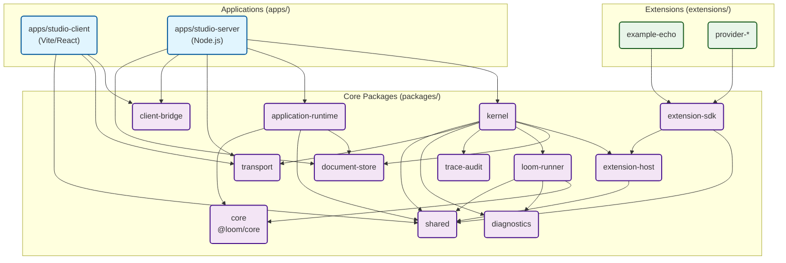

# 工作区包依赖关系图 (Dependency Graph)

Loom Studio 严格遵循依赖单向流动（从外围应用到内核）的设计原则。不允许出现循环依赖，也不允许内部基础设施依赖具体的应用逻辑。

## 依赖全景图

## 核心约束规则

1. **受控 Core 依赖**：只有 `packages/loom-runner` 与 `packages/application-runtime` 被允许导入 `@loom/core` public API。前者负责平台 adapter，后者负责第一方 PromptBuild pipeline；其余模块不得直接依赖 Core。
2. **应用逻辑闭环**: `packages/kernel` 是一个纯粹的执行引擎，不允许导入 `packages/application-runtime`。所有的应用逻辑（如 Session, PromptBuilder 等）均在 Runtime 和 Server 层组装。
3. **共享基础**: `packages/shared` 和 `packages/transport` 位于最底层，不允许依赖除了外部库之外的任何工作区内的包。
