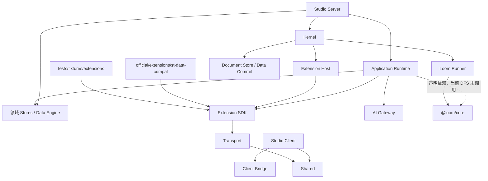

# 工作区包依赖关系图 (Dependency Graph)

> **状态**：Active Reference / Current Workspace Manifests Are Authority

下图只展示主要分层，不是全量依赖图。箭头表示使用方依赖被使用方；精确 dependencies 以各 Package 的 package.json 为准。声明依赖不代表当前某条业务路径实际调用了它。

## 主要依赖

关键入口：

- [Application Runtime manifest](../../../packages/application-runtime/package.json)
- [Kernel manifest](../../../packages/kernel/package.json)
- [Extension SDK manifest](../../../packages/extension-sdk/package.json)
- [Extension Host manifest](../../../packages/extension-sdk/extension-host/package.json)
- [Transport manifest](../../../packages/transport/package.json)

## 核心约束

1. Core 直接依赖只允许在 Loom Runner 与 Application Runtime 中声明。当前 Loom Runner 实际执行 Core，Agent PromptBuild 使用 Application 内部 DFS；见 [集成事实](../../architecture/application/prompt-build/loom-core/studio-integration.md)。
2. Kernel 不依赖 Application Runtime，不拥有 Card、Agent 或 Prompt 业务语义。
3. Host 实现依赖 SDK 作者合同，SDK 不反向依赖 Host；Host 物理目录嵌在 SDK 目录下不改变这个方向。
4. Transport 可以依赖 Shared；共享基础设施不得反向依赖具体 Application 或 Client。
5. 官方扩展与测试样本分别在 `official/extensions/` 和 `tests/fixtures/extensions/`，不再以根 `extensions/` 作为当前源码入口。
